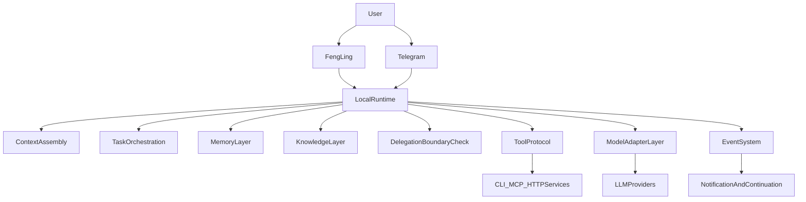

# 系统设计总览

本文档描述目标态设计，不受当前实现细节约束。

## 设计目标

- 围绕风铃这个自有主客户端打磨核心体验；Telegram 等外部集成只承担辅助通知或轻量触达角色。
- 保持多入口共享同一分身 runtime，而不是按渠道拆成多个产品。
- 把产品资产沉淀在本地 runtime 管理的任务、记忆、知识、工具协议中，而不是绑定到某家模型供应商的原生能力。
- 通过清晰的需求层、设计层、实现层分离，避免产品定义和实现细节互相污染。
- 让验收场景先于实现存在，使 AI 的实现结果能被需求层用例和设计层评测协议共同约束。

## 总体结构

## 主模块

### 风铃

风铃是自有移动端主客户端，负责更沉浸的语音/文字交互、任务发起、附件承载、语音反馈和可视化进度感知。

### Telegram

Telegram 是可选外部集成，重点承担通知、轻量触达和少量临时指令。它共享同一 runtime，不拥有独立的大脑，也不假定承载完整客户端体验。

### Runtime Core

Runtime Core 负责：

- 会话与上下文组装
- 任务建模、状态流转与续作
- 记忆层写入与读取策略
- 知识层接入与资产管理
- 工具调用编排
- 结果生成与回报策略
- 执行前委托边界检查

### Model Adapter Layer

模型适配层是薄层，只承担消息格式、工具 schema、提供商差异与响应转换。任务、记忆、知识和 skills 都不应沉淀在这一层。

### Tool Protocol

所有能力接入统一通过工具协议暴露给 runtime。无论底层是 CLI、MCP、HTTP 还是本地服务，对 runtime 都应表现为一致的工具面。

### Event System

事件系统负责承载所有非阻塞推进：定时器、外部回调、主动通知和任务续作。runtime 只发布意图，不直接承担长时间等待。

### Memory Layer 与 Knowledge Layer

- 记忆层：低成本、可人工维护、偏事实与偏好沉淀。
- 知识层：高价值、可关联、可追踪来源、可维护的长期资产。

## 层级边界

| 层级 | 回答的问题 | 不该回答的问题 |
|------|------------|----------------|
| `requirements/` | 产品要什么、如何衡量 | 当前端口、脚本、类名 |
| `design/` | 系统如何组织、为什么这样设计 | 当前完成度、一次性运行步骤 |
| `implementation/` | 实际代码、脚本、测试与运行现状 | 重新定义产品需求 |

## AI 原生验证闭环

仓库中的验证链路也遵循三层分离：

1. `requirements/acceptance/` 先定义用户场景和通过标准。
2. `design/evaluation/` 定义测试分型、evidence trace 和 judge rubric。
3. `implementation/tests/` 与 `implementation/evals/` 负责运行、收集证据和生成报告。

这样测试不再只是“实现后的自测代码”，而是 AI 实现前就存在的产品约束。

## 进一步阅读

- [Runtime Core](runtime-core.md)
- [风铃渠道设计](channel-fengling.md)
- [模型适配层](model-adapter.md)
- [数据与知识设计](data-knowledge.md)
- [事件系统接口](../interfaces/event-system.md)
- [评测协议](../evaluation/eval-protocol.md)
- [服务职责映射](../service-map.md)
